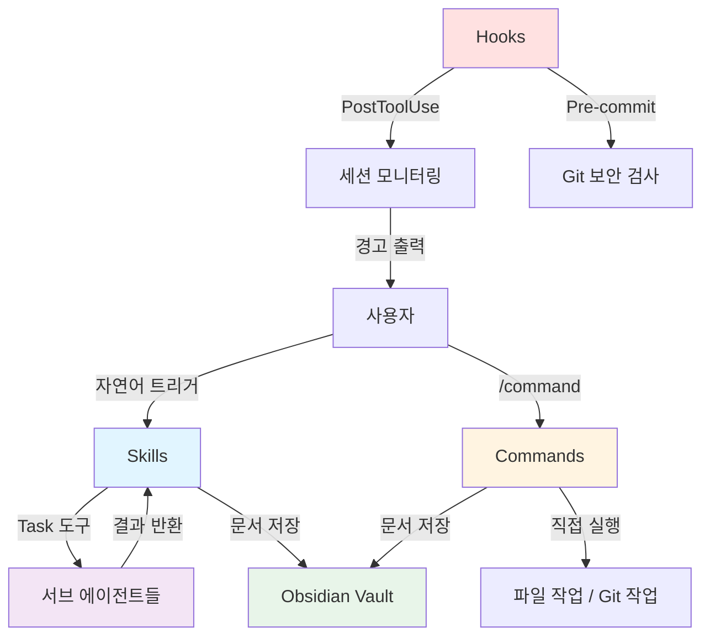
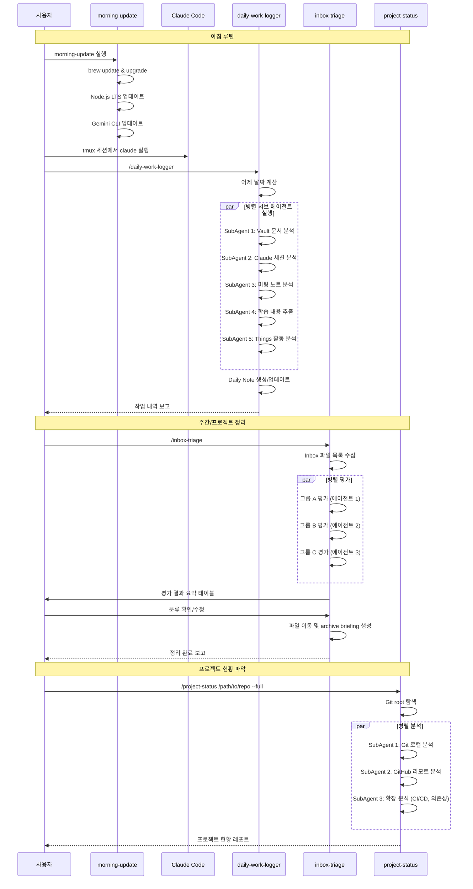
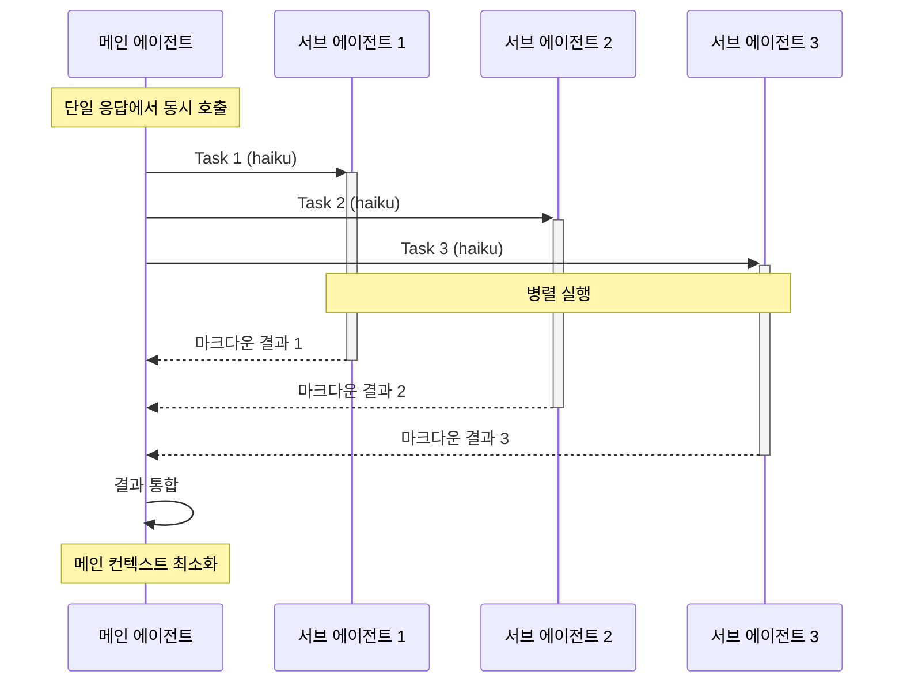
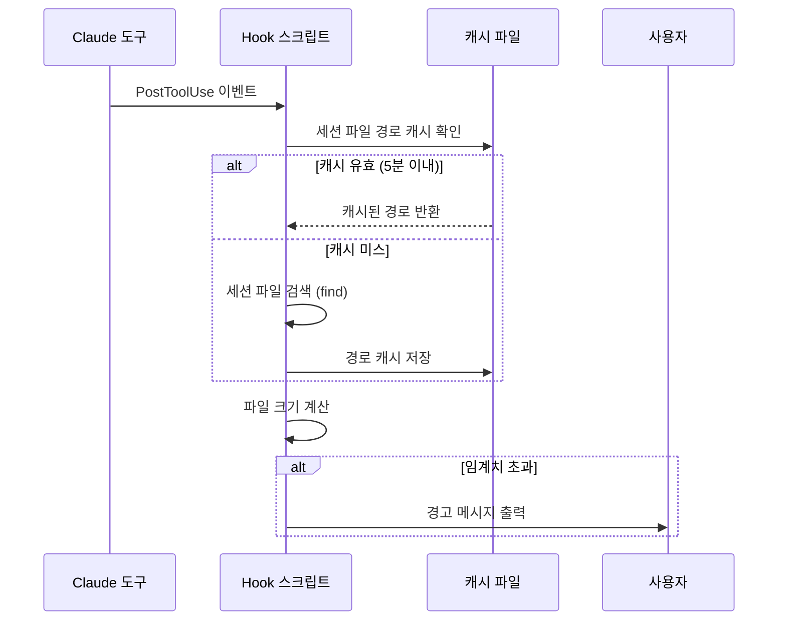

# Claude Code 워크플로우 시스템

## 개요

이 문서는 dotfiles에 구축된 Claude Code 워크플로우 생태계를 설명합니다. Skills, Commands, Hooks로 구성된 자동화 시스템으로, 일일 업무 루틴부터 프로젝트 관리까지 전체 워크플로우를 지원합니다.

## 시스템 아키텍처

### 구성 요소 관계



### 도구 분류

| 도구 | 경로 | 트리거 방식 | 주 용도 |
|------|------|-----------|---------|
| Skills | `.claude/skills/*/` | 자동 감지 (description match) | 복잡한 분석, 서브 에이전트 기반 병렬 처리 |
| Commands | `.claude/commands/*.md` | `/command-name` | 단순 작업, 즉시 실행 |
| Hooks | `.claude/hooks/*.sh` | 이벤트 기반 (자동 실행) | 세션 모니터링, 경고 |

## 일일 루틴 플로우



## Skills 카탈로그

### 일일 루틴 및 분석

| 이름 | 트리거 | 설명 |
|------|--------|------|
| daily-work-logger | "어제 작업 정리", "daily log", "업무 내역 정리" | 어제 작업 내역을 Daily Note에 자동 반영 (5개 서브 에이전트 병렬) |
| learning-tracker | "학습 정리", "TIL", "오늘 배운 것", "learning" | Claude 세션에서 학습 내용 추출하여 TIL 문서 생성 |
| usage-pattern-analyzer | "사용 패턴", "usage pattern" | Claude 도구 사용 패턴 분석 및 최적화 제안 |
| work-tracker | "작업 추적", "work tracker" | 작업 시간 및 활동 추적 |

### Obsidian Vault 관리

| 이름 | 트리거 | 설명 |
|------|--------|------|
| obsidian-vault | "Obsidian", "vault", "마크다운", "태그", "PARA", "백링크", "wiki-link", "PKM" | markdown-oxide LSP 활용한 vault 작업 가이드 제공 |
| inbox-triage | "인박스 정리", "inbox triage", "inbox cleanup", "옵시디언 정리" | Obsidian Inbox 문서 평가 및 PARA 구조로 분류 이동 |
| vis | "시맨틱 검색", "vis" | vault-intelligence CLI 사용 가이드 |

### 프로젝트 및 Git 관리

| 이름 | 트리거 | 설명 |
|------|--------|------|
| project-status | "프로젝트 현황", "project status", "현황 파악", "상태 확인" | Git/GitHub 현황 종합 분석 레포트 출력 (서브 에이전트 병렬) |
| git-worktree-summary | "워크트리 요약", "worktree summary" | Git worktree 목록 및 상태 요약 |
| codebase-verify | "코드베이스 검증", "codebase verify" | 코드베이스 구조 및 일관성 검증 |
| gh | "github", "gh" | GitHub CLI 작업 가이드 |

### 콘텐츠 제작

| 이름 | 트리거 | 설명 |
|------|--------|------|
| youtube-scriptwriter | "유튜브 대본", "youtube script" | 유튜브 스크립트 작성 (6개 서브 에이전트 협업) |
| youtube-uploader | "유튜브 업로드", "youtube upload" | YouTube 영상 업로드 자동화 |
| brunch-writer | "브런치", "brunch" | 브런치 글 작성 지원 |
| cover-letter | "자기소개서", "cover letter" | AI 감지 우회 자기소개서 작성 |

### 특화 도구

| 이름 | 트리거 | 설명 |
|------|--------|------|
| pdf-processing-pro | "pdf", "문서 처리" | PDF 처리 (OCR, 표, 양식) |
| react-best-practices | "react", "리액트" | React 베스트 프랙티스 가이드 |
| databricks-academy | "databricks", "academy" | Databricks 학습 자료 관리 |
| backlog-md | "백로그", "backlog" | Markdown 기반 백로그 관리 |
| jira | "jira", "이슈" | Jira 이슈 관리 |
| skill-creator | "스킬 생성", "skill create" | 새로운 skill 생성 도구 |

## Commands 카탈로그

| 이름 | 경로 | 설명 |
|------|------|------|
| askUserQuestion | `.claude/commands/` | 사용자에게 질문하여 응답 수집 |
| check-security | `.claude/commands/` | 보안 취약점 검사 |
| coffee-time | `.claude/commands/` | 팀 커피타임 대화 정리 → GitHub 저장 |
| commit | `.claude/commands/` | Git 커밋 메시지 자동 생성 및 커밋 실행 |
| meeting-minutes | `.claude/commands/` | 미팅 노트 자동 생성 |
| my-developer | `.claude/commands/` | 개발자 프로필 참조 |
| project-overview | `.claude/commands/` | 프로젝트 개요 생성 |
| tBlog | `.claude/commands/` | 기술 블로그 글 작성 |
| tBlog2 | `.claude/commands/` | 기술 블로그 글 작성 (v2) |
| update-claude-md | `.claude/commands/` | CLAUDE.md 파일 업데이트 |
| workthrough | `.claude/commands/` | 세션 작업 과정을 walkthrough 문서로 정리 |
| **obsidian/** | `.claude/commands/obsidian/` | Obsidian vault 관련 명령어 모음 |
| - add-tag | `obsidian/` | 노트에 태그 추가 |
| - add-tag-and-move-file | `obsidian/` | 태그 추가 후 파일 이동 |
| - batch-process | `obsidian/` | 노트 일괄 처리 |
| - batch-summarize-urls | `obsidian/` | URL 목록 일괄 요약 |
| - batch-translate-urls | `obsidian/` | URL 목록 일괄 번역 |
| - create-presentation | `obsidian/` | 프레젠테이션 생성 |
| - related-contents | `obsidian/` | 관련 콘텐츠 검색 |
| - summarize-article | `obsidian/` | 아티클 요약 |
| - summarize-youtube | `obsidian/` | YouTube 영상 요약 |
| - translate-article | `obsidian/` | 아티클 번역 |
| - weekly-social-posts | `obsidian/` | 주간 소셜 포스트 생성 |
| **blog/** | `.claude/commands/blog/` | 블로그 관련 명령어 모음 |
| - quality-check | `blog/` | 블로그 글 품질 검사 |

## Hooks 카탈로그

| 파일명 | 트리거 이벤트 | 용도 |
|--------|-------------|------|
| context-monitor.sh | PostToolUse (모든 도구) | 세션 JSONL 파일 크기 모니터링, 컨텍스트 조기 경고 (30MB/60MB/90MB) |
| edit-counter.sh | PostToolUse (Edit/Write) | 동일 파일 반복 수정 감지, 5회 이상 시 리팩토링 제안 |
| watch-notify.sh | PostToolUse, Stop, UserPromptSubmit | Apple Watch 알림 전송 (에러, 입력 필요, 작업 완료) |
| check-env-files.sh | Pre-commit (Git hook) | .env 파일 커밋 방지 (.env.*.example만 허용) |
| check-hardcoded-paths.sh | Pre-commit (Git hook) | 하드코딩된 개인 경로 검사 (/Users/msbaek) |
| check-sensitive-files.sh | Pre-commit (Git hook) | 민감한 파일 커밋 방지 |
| update-brewfile.sh | Manual / Scheduled | Brewfile 자동 업데이트 |

## 핵심 컨벤션

### 1. 파일명 규칙

| 파일 타입 | 형식 | 저장 위치 | 예시 |
|----------|------|-----------|------|
| Workthrough | `YYMMDD-{scope}-{number}-{description}.md` | `{OBSIDIAN_INBOX}/` | `260318-shago-01-api-design.md` |
| Daily Note | `YYYY-MM-DD.md` | `{OBSIDIAN_VAULT}/02-Areas/dailies/` | `2026-03-18.md` |
| Archive Briefing | `YYMMDD-inbox-archive-briefing.md` | `{OBSIDIAN_VAULT}/04-Archive/` | `260318-inbox-archive-briefing.md` |
| Coffee Time | `YYYY. M. DD. 커피타임.md` | `~/git/kt4u/coffee-time/` | `2026. 3. 18. 커피타임.md` |

### 2. 경로 상수

| 상수 | 경로 | 사용처 |
|------|------|--------|
| `OBSIDIAN_VAULT` | `~/Library/Mobile Documents/iCloud~md~obsidian/Documents/chan99k's vault/chan99k's vault` | Skills, Commands |
| `OBSIDIAN_INBOX` | `{OBSIDIAN_VAULT}/00-Inbox` | workthrough, inbox-triage |
| `WORKSPACE` | `~/chan99k-workspace` | 프로젝트 symlink 허브 |
| `DOTFILES` | `~/dotfiles` | 설정 파일 저장소 |

### 3. Git 커밋 메시지

**형식**: Conventional Commits + 한글 본문

```
type: subject (50자 이내, 영문)

- 본문 1 (72자 줄바꿈, 한글, 이유와 영향 중심)
- 본문 2 (최대 3개 항목)
- 본문 3
```

**타입 종류**:

| 타입 | 용도 | 예시 |
|------|------|------|
| `feat` | 새로운 기능 추가 | `feat: add user authentication` |
| `fix` | 버그 수정 | `fix: resolve login timeout issue` |
| `docs` | 문서 수정 | `docs: update API documentation` |
| `style` | 코드 포맷팅, 세미콜론 등 | `style: apply prettier formatting` |
| `refactor` | 코드 리팩토링 | `refactor: extract validation logic` |
| `test` | 테스트 추가/수정 | `test: add unit tests for auth module` |
| `chore` | 빌드, 패키지 매니저 등 | `chore: update dependencies` |

**한글 메시지 처리 (필수)**:

```bash
# 1. Write 도구로 임시 파일 생성
# /tmp/commit_msg.txt에 메시지 작성

# 2. git commit -F 옵션 사용
git commit -F /tmp/commit_msg.txt

# 3. 임시 파일 정리
rm /tmp/commit_msg.txt
```

**주의**: HEREDOC 방식 (`cat <<'EOF'`) 사용 금지 - 한글이 유니코드 이스케이프로 깨짐

### 4. Obsidian PARA 구조

| 폴더 | 용도 | 작업 권한 |
|------|------|-----------|
| `00-Inbox` | 미분류 수집함 | 읽기/쓰기 |
| `01-Projects` | 활성 프로젝트 (giftify, blog, shago, lxm) | 읽기/쓰기 |
| `02-Areas` | 지속 영역 (career, dailies) | 읽기/쓰기 |
| `03-Resources` | 주제별 참고자료 (spring, java, network 등) | 주로 읽기 |
| `04-Archive` | 비활성/완료 자료 | 주로 읽기 |

### 5. 태그 체계

**형식**: `#category/subcategory/detail`

**5가지 카테고리**:
- Topic: 주제별 분류 (`#topic/kubernetes`, `#topic/spring`)
- Document Type: 문서 유형 (`#doctype/tutorial`, `#doctype/reference`)
- Source: 출처 (`#source/official-docs`, `#source/blog`)
- Status: 상태 (`#status/active`, `#status/archived`)
- Project: 프로젝트 (`#project/giftify`, `#project/blog`)

## Skill vs Command 선택 기준

| 기준 | Skill | Command |
|------|-------|---------|
| 복잡도 | 높음 (다단계 분석) | 낮음 (단순 작업) |
| 서브 에이전트 | 사용 (병렬 처리) | 미사용 |
| 트리거 | 자연어 감지 | `/` 슬래시 명령 |
| 컨텍스트 비용 | 최소화 (서브 에이전트 격리) | 직접 실행 |
| 사용 시점 | 정기 루틴, 대량 분석 | 즉시 실행, 단일 작업 |

## Shell 함수 및 Alias

### .zshrc 정의 함수

| 함수 | 설명 |
|------|------|
| `morning-update` | 아침 시스템 업데이트 (brew, Node.js LTS, Gemini CLI) |
| `update-node-lts` | Node.js LTS 최신 버전 설치 및 기본 설정 |
| `update-claude-code` | Claude Code 업데이트 |
| `obs <command>` | Obsidian CLI (vault 디렉토리에서 실행) |
| `y` | yazi 파일 매니저 (종료 시 디렉토리 변경) |

### Alias

| Alias | 명령어 | 설명 |
|-------|--------|------|
| `tmux-clean` | `~/.tmux/scripts/tmux-clean.sh` | tmux 세션 정리 |
| `masking` | `sed "s/=.*/=****/"` | 환경 변수 값 마스킹 |
| `yt-dlp` | `~/.local/bin/yt-dlp-safe` | 보안 wrapper (--exec, --netrc-cmd 차단) |

## 워크플로우 최적화 전략

### 컨텍스트 절약

1. **서브 에이전트 병렬 실행**: 메인 에이전트는 최종 결과만 수신
2. **haiku 모델 사용**: 서브 에이전트는 저렴한 모델로 실행
3. **파일 선택적 로드**: MOC 노트 우선, 한 번에 10개 이하
4. **정기적 압축**: 20회 반복 후 `/compact` 또는 `/clear`

### 병렬 처리 패턴



**핵심 원칙**:
- 단일 응답에서 모든 Task 동시 호출 (병렬 실행)
- 서브 에이전트는 haiku 모델 사용 (비용 절감)
- 서브 에이전트는 마크다운 결과만 반환 (컨텍스트 최소화)
- 실패 격리: 개별 서브 에이전트만 재시도

### Hook 기반 모니터링



## 관련 도구 및 MCP 서버

| 도구/서버 | 용도 | 설치 |
|-----------|------|------|
| markdown-oxide | Obsidian vault LSP | MCP 서버 |
| Things MCP | Things 3 작업 추적 | `claude mcp add-json -s user things '{"command":"uvx","args":["things-mcp"]}'` |
| vis (vault-intelligence) | 시맨틱 vault 검색 | `pipx install vault-intelligence` |
| obsidian CLI | vault 파일 이동 (백링크 업데이트) | Obsidian 앱 내장 |
| gh CLI | GitHub 작업 | `brew install gh` |
| terminal-notifier | Apple Watch 알림 | `brew install terminal-notifier` |

## 문제 해결

### 컨텍스트 경고 발생 시

| 경고 레벨 | JSONL 크기 | 조치 |
|----------|----------|------|
| warning | 30MB+ | 세션이 길어지는 중. 작업 계속 가능. |
| high | 60MB+ | 복잡한 새 작업은 별도 세션 고려. |
| critical | 90MB+ | `/compact` 실행 또는 새 세션 시작 강력 권장. |

### 파일 반복 수정 경고 시

- 동일 파일 5회 이상 수정 → 구조 변경 또는 일괄 처리 스크립트 고려
- 에이전트가 반복 수정하는 경우 → 코드 품질 경고 (canary in the code mine)

### Obsidian 파일 이동 시

1. **우선**: `obsidian move` CLI (백링크 자동 업데이트)
2. **차선**: `mv` 명령 (Obsidian 앱 미실행 시, 백링크 수동 확인 필요)

### 한글 커밋 메시지 깨짐

- HEREDOC 방식 금지
- Write 도구로 임시 파일 생성 후 `git commit -F` 사용

## 확장 가이드

### 새 Skill 생성

1. `/skill-creator` 실행하여 스켈레톤 생성
2. `SKILL.md` 작성 (YAML frontmatter + 프롬프트)
3. `references/` 디렉토리에 참고 자료 추가
4. 자연어 트리거 키워드는 `description:` 필드에 명시

### 새 Command 생성

1. `.claude/commands/{name}.md` 파일 생성
2. YAML frontmatter 작성:
   ```yaml
   ---
   argument-hint: "[옵션]"
   description: "명령어 설명"
   ---
   ```
3. 프롬프트 본문 작성 (마크다운 형식)

### 새 Hook 추가

1. `.claude/hooks/{name}.sh` 파일 생성
2. 실행 권한 부여: `chmod +x .claude/hooks/{name}.sh`
3. 환경 변수 활용:
   - `CLAUDE_HOOK_EVENT`: 이벤트 타입
   - `CLAUDE_TOOL_NAME`: 도구 이름
   - `CLAUDE_TOOL_EXIT_CODE`: 종료 코드
4. 반드시 `exit 0` (실패해도 Claude 차단 방지)

---

**마지막 업데이트**: 2026-03-18
