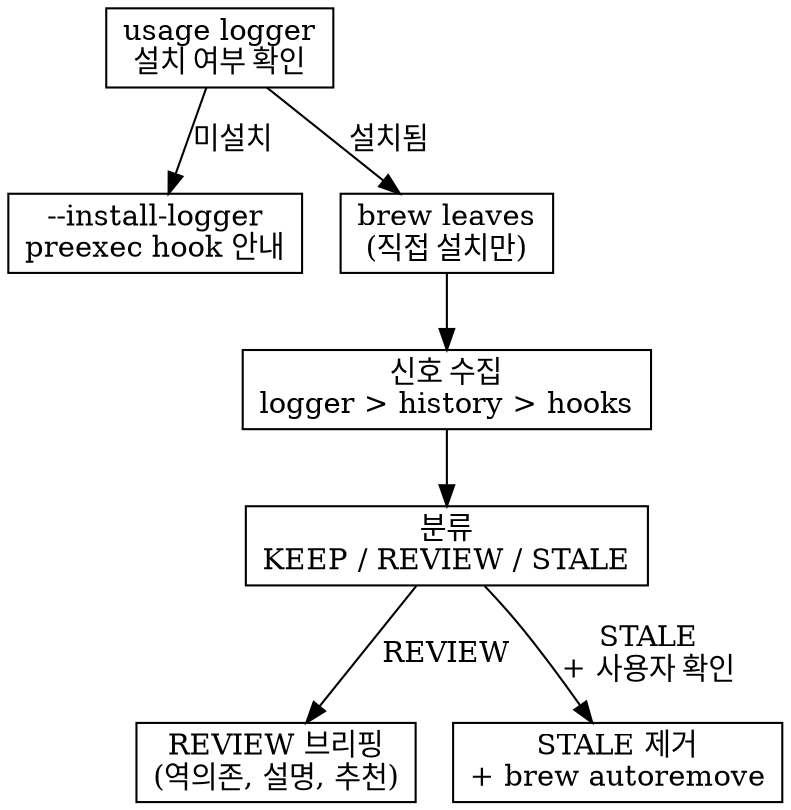

# brew-audit

Scan installed Homebrew packages, assess usage recency via multiple signals, auto-remove 6-month stale packages, and brief 3-month stale packages for human review.

## When to Use

- User asks to clean up Homebrew packages
- Periodic maintenance (monthly/quarterly)
- Before Brewfile overhaul or dotfiles cleanup

## Signal Hierarchy (most → least reliable)

| Priority | Signal | Source | Notes |
|----------|--------|--------|-------|
| 1 | **Usage logger** | `~/.brew-usage.log` | preexec hook 기록. 가장 정확 |
| 2 | **zsh_history** | `~/.zsh_history` | `: epoch:0;command` 형식. 쉘 직접 호출만 |
| 3 | **Hook/service** | lefthook.yml, LaunchAgents, cron | 참조 있으면 무조건 KEEP |
| 4 | **Dotfiles 간접 참조** | .gitconfig, .zshrc, .tmux.conf 등 | config에서 쓰이면 KEEP |
| 5 | **Brewfile** | `~/Brewfile` | STALE→REVIEW 격상 (자동 제거 방지) |

### Cellar mtime은 사용하지 않음

`brew upgrade`를 정기 실행하면 Cellar mtime은 항상 최신. 사용 여부와 무관.

### Package Name ≠ Binary Name

`brew list --formula <pkg> | grep '/bin/'` 로 실제 바이너리 이름 해석 후 history grep.

## Workflow



## Commands

```bash
# 분석 리포트 (dry-run)
bash ~/.claude/skills/brew-audit/brew-audit.sh

# usage logger 설치 (최초 1회)
bash ~/.claude/skills/brew-audit/brew-audit.sh --install-logger

# logger 상태 확인
bash ~/.claude/skills/brew-audit/brew-audit.sh --logger-status

# 6개월+ 미사용 패키지 제거
bash ~/.claude/skills/brew-audit/brew-audit.sh --remove-stale
```

## Safety Guards

1. **REVIEW 패키지는 절대 자동 제거 안 함** — 브리핑 후 사용자 확인 필수
2. **Brewfile 선언 패키지** → STALE이어도 REVIEW로 격상
3. **Hook/service 참조 패키지** → 무조건 KEEP
4. **신호 없는 패키지** → STALE이 아닌 REVIEW (데이터 없으면 보수적으로)
5. **`brew uses --installed`** 로 역의존 확인 후 REVIEW 브리핑에 포함

## Common Mistakes

| Mistake | Correct |
|---------|---------|
| Cellar mtime = 사용일 | mtime = 설치/업그레이드일. 매일 upgrade 시 무의미 |
| APFS atime 신뢰 | APFS atime 불안정. history/logger 사용 |
| history에 없으면 미사용 | IDE, GUI, hook, library 호출은 history에 안 잡힘 → REVIEW |
| Brewfile 패키지 자동 제거 | `brew bundle` 깨짐. Brewfile에서 먼저 제거 필요 |
| 패키지명으로 history grep | 바이너리명이 다를 수 있음. `brew list` 로 해석 |
| zsh plugin 무시 | `zsh-syntax-highlighting`은 `source`로 로드, history 안 잡힘. `.zshrc` 파싱 |
| gitconfig tool 무시 | `delta`는 git pager로 매번 쓰이지만 직접 호출 안 함. `.gitconfig` 스캔 |
| lefthook.yml 존재 무시 | 파일 존재 = `lefthook` 패키지 사용 증거. config 파일명→패키지 매핑 |
