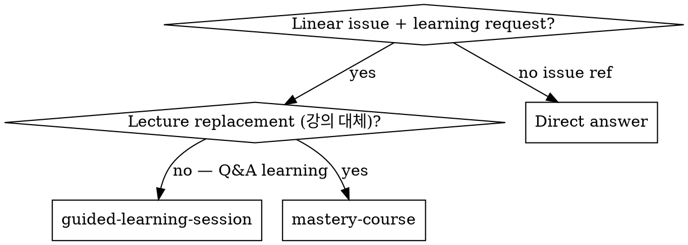
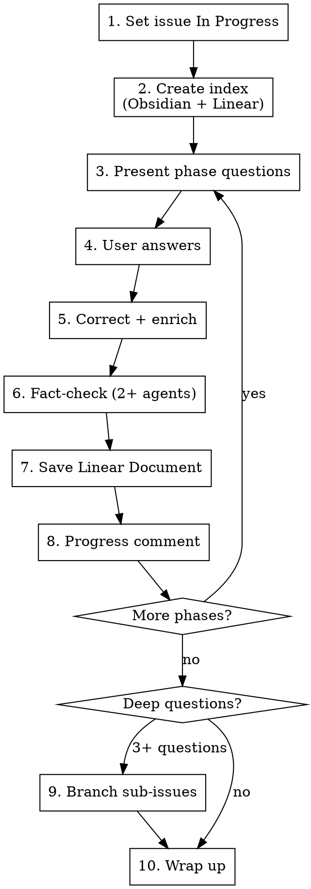

# Guided Learning Session

Interactive Q&A-driven learning tied to a Linear issue. The user answers questions first, then receives corrections — not a lecture.

**Core principle:** Learning through self-testing and correction beats passive reading. Every artifact is fact-checked before persistence, and every artifact lives in both Obsidian and Linear.

## When to Use



**Triggers:**
- "99K-NNN에 대해 가이드 학습", "학습 세션 시작", "기술 비교 학습"
- Linear issue ID + learning-related request
- "면접 대비 학습", "ADR용 기술 학습"

**Do NOT use:**
- One-off technical question without issue context → direct answer
- Lecture/course replacement → `mastery-course`
- Deep-dive document generation without Q&A → `deep-dive-doc`

## Core Workflow



### Step 1: Set Issue Status

Change the Linear issue to **In Progress**. Do this before any content work.

### Step 2: Create Index Document

Build a structured learning index with:
- Phase breakdown (numbered, with estimated time)
- Reference links per phase (official docs, community articles)
- Core comparison points / key takeaways preview

**Save to BOTH locations:**
- Obsidian: `{OBSIDIAN_INBOX}/YYMMDD-{SCOPE}-NN-{topic}-study-index.md`
- Linear: Document linked to the issue

The index front-matter must include:
```markdown
> Linear: [{issue-id}](linear-url)
> Goal: {one-line learning objective}
```

### Step 3-5: Phase Q&A Loop

**This is NOT a lecture. Ask questions first.**

Each phase:
1. **Present 2-4 questions** covering the phase topic
2. **Wait for user answers** — do not provide answers preemptively
3. **Correct and enrich** — compare user's answers against accurate information
   - Acknowledge what was correct
   - Correct misconceptions with explanation
   - Add depth the user didn't cover
   - Connect to the project context (why this matters for their specific project)

### Step 6: Fact-Check

Before saving any document, run fact-check agents.

**Intensity rules:**

| Topic sensitivity | Agent count | Model |
|---|---|---|
| Default | 2 agents | sonnet |
| High stakes (interview-critical, architecture decision) | 3 agents | sonnet |
| Simple/well-established facts | 1 agent | sonnet |

Each agent receives the full Q&A content and verifies independently. Use `technical-researcher` agent type.

**Embed results in every document:**
- `✅ CONFIRMED` — original claim stands
- `⚠️ CORRECTED` — what changed, why, source URL

### Step 7: Save as Linear Document

Create a Linear Document linked to the parent issue. Include:
- Full Q&A content (question, user answer, correction)
- Fact-check results embedded inline
- Reference URLs
- Project context section (optional, when applicable)

### Step 8: Progress Comment

After each phase completion, add a comment to the parent issue:
```
Phase {N} ({topic}) 완료. 주요 학습 포인트: {2-3 bullet points}
```

### Step 9: Sub-Issue Branching

When the user asks **3 or more** deep follow-up questions after phase completion:

1. Create a **sub-issue** per question under the parent issue
2. Each sub-issue gets its own **fact-checked Document**
3. Mark sub-issues as **Done** when the document is saved

**Sub-issues are NOT Q&A loops.** The user already asked the question — answer directly, fact-check, save. Do not re-ask what the user just asked. The Q&A loop (Step 3-5) applies only to phase-level learning.

```
Parent Issue (99K-NNN)
├── Documents: Phase 1, Phase 2, ...
├── Comments: progress updates
└── Sub-issues: one per deep question
    └── Each has 1 linked Document
```

See [linear-study-tracking.md](linear-study-tracking.md) for detailed Linear conventions.

**Ordering:** Answer in the user's original order unless there's a clear dependency chain (e.g., "clustering basics" before "cluster HA comparison").

### Step 10: Wrap Up

When learning is complete (user indicates or all phases done):
- Add a final summary comment on the parent issue
- Update Obsidian index with completion markers
- Ask user whether to close the issue or keep it open for future learning

## Project Context Section (Optional)

When the learning topic relates to a technology choice in the user's project, include:

```markdown
## Project Context — Why This Matters for {Project}

- Workload analysis: {read/write ratio, user count, data volume}
- Scale judgment: {does this difference matter at this scale?}
- Trade-off acknowledgment: {what you give up with this choice}
- 30-Second Answer: {concise answer for interview/review}
```

This section helps the user build ADR-ready arguments, not just theoretical knowledge.

## Quick Reference

| Situation | Action |
|---|---|
| Starting a session | Set issue In Progress → create index → start Phase 1 |
| Phase complete | Fact-check → save Document → progress comment |
| 3+ deep questions | Create sub-issues, not one big document |
| Saving any document | Obsidian + Linear, never just one |
| Before saving | Always fact-check (minimum 1 agent) |
| User gives wrong answer | Acknowledge correct parts first, then correct |
| Topic is interview-critical | Use 3-agent fact-check |
| Session spanning multiple conversations | Update index with progress markers |

## Common Mistakes

**Lecture mode:** Presenting information before asking questions. The user must attempt answers first — this is how learning actually works. The correction after a wrong answer is far more memorable than a pre-emptive explanation.

**Single-document dumping:** Putting 6 deep questions into one massive document. Each question deserves its own sub-issue and document for clean tracking and future reference.

**Skipping Obsidian save:** Linear Documents are great for tracking but hard to search across projects. The Obsidian index is the cross-project discovery layer.

**Self-validating facts:** Using your own knowledge to verify your own claims. Always spawn a separate fact-check agent — it catches errors you're blind to.

**No project context:** Teaching theory without connecting to the user's actual project. Always ask: "does this difference matter at YOUR scale/workload?"

## Integration

**REFERENCE:** [linear-study-tracking.md](linear-study-tracking.md) — Linear hierarchy and document conventions
**RELATED:** `mastery-course` — For lecture-replacement workflows (not Q&A learning)
**RELATED:** `deep-dive-doc` — For generating reference documents without Q&A interaction
**RELATED:** `competing-agents` — Fact-check pattern origin (2+ agent cross-verification)
**MEMORY:** `feedback-guided-learning-session-workflow` — Workflow evolution history
**MEMORY:** `feedback-competing-subagents` — Competition-based verification preference
