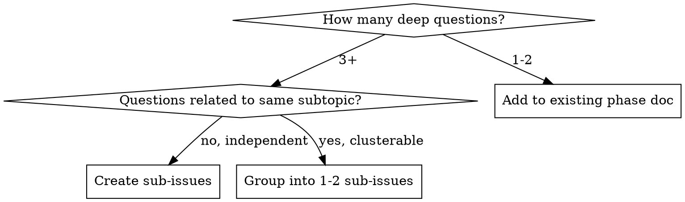

# Linear Study Tracking — Reference

Conventions for structuring learning artifacts in Linear. Used by `guided-learning-session` and reusable by other skills that track study progress in Linear.

## Hierarchy Pattern

```
Project (e.g., NovA)
└── Issue: {99K-NNN} "{learning topic}"          ← parent, status: In Progress
    ├── Documents (phase-level)
    │   ├── "Phase 1-1: {subtopic}"               ← Q&A content + fact-check
    │   ├── "Phase 1-2: {subtopic}"
    │   └── "Phase 2: {subtopic}"
    ├── Comments (progress markers)
    │   ├── "Phase 1 완료. 주요 학습: ..."
    │   └── "Phase 2 완료. 주요 학습: ..."
    └── Sub-issues (deep questions)
        ├── {99K-NNN+1} "{question topic 1}"      ← status: Done when doc saved
        │   └── Document: "{question topic 1}"
        ├── {99K-NNN+2} "{question topic 2}"
        │   └── Document: "{question topic 2}"
        └── ...
```

## Document Naming

| Level | Format | Example |
|---|---|---|
| Phase doc | `Phase {M}-{N}: {topic}` | Phase 1-1: 커넥션 모델 |
| Deep question doc | `{topic} — {aspect}` | Redis: Sentinel vs Cluster HA 비교 |
| Index doc | `{topic} 학습 인덱스` | MySQL vs PostgreSQL 학습 인덱스 |

## Document Content Structure

Every learning document follows this structure:

```markdown
# {Document Title}

> Parent: [{issue-id}]({linear-url})
> Phase: {N} | Date: {YYYY-MM-DD}

## Questions & Answers

### Q1: {question}
**User answer:** {what the user said}
**Correction/Enrichment:** {accurate information with explanation}

### Q2: ...

## Fact-Check Results
{✅ CONFIRMED / ⚠️ CORRECTED items with source URLs}

## Key Takeaways
- {2-3 bullet points}

## References
- {numbered list of source URLs}

## Project Context (optional)
{workload analysis, scale judgment, trade-off}
```

## Progress Comment Format

After each phase:
```
Phase {N} ({topic}) 완료.
- {key point 1}
- {key point 2}
- {key point 3}
다음: Phase {N+1} ({next topic})
```

Final summary:
```
학습 완료 요약:
- Phase 1~{N} 전체 {M}개 문서 작성
- 서브이슈 {K}개 심화 학습 완료
- 주요 결론: {one-line takeaway}
```

## Sub-Issue Conventions

- **Title:** Concise question topic (not the full question)
- **Description:** The full question text + why it matters
- **Parent:** Set to the learning issue
- **Status flow:** Backlog → In Progress (when answering) → Done (when doc saved)
- **Label:** Inherit from parent issue

## Status Management

| Event | Action |
|---|---|
| Session starts | Parent issue → In Progress |
| Phase doc saved | Add progress comment |
| Deep question answered | Sub-issue → Done |
| All phases complete | Ask user: close or keep open |
| User explicitly done | Parent issue → Done |

## When to Create Sub-Issues vs. Extend Document


