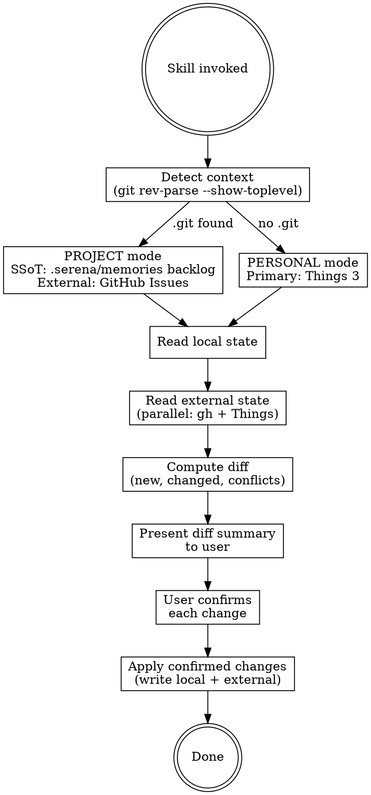

# Work Tracker

Bidirectional task sync between local backlog and external systems (GitHub Issues, Things 3).
Refer to `references/sync-conventions.md` for ID formats, status mapping, and tool-specific integration details.

## Usage

```
/work-tracker [mode] [description]

Modes:
  start   Session start. Pull external changes into local backlog.
  end     Session end. Push local changes to external systems.
  add     Add a new item to both local and external simultaneously.
  sync    Full bidirectional sync (start + end combined).
```

When no mode is specified, default to `sync`.

## Workflow



## Step 1: Context Detection

```bash
git rev-parse --show-toplevel 2>/dev/null
```

- **Success (.git found)**: PROJECT mode
  - Local SSoT: `.serena/memories/` backlog markdown files (search for `improvement-backlog.md` or similar)
  - If not found, check `docs/backlog.md`
  - External primary: GitHub Issues (`gh issue list`)
  - External supplementary: Things 3 (MCP)

- **Failure (no .git)**: PERSONAL mode
  - Primary system: Things 3 (MCP)
  - No local backlog file; Things 3 IS the source of truth

Identify the GitHub repo (if PROJECT mode) via `gh repo view --json nameWithOwner -q .nameWithOwner`.

## Step 2: Read State (Parallel)

Gather data from all relevant sources concurrently using subagents or parallel tool calls.

**PROJECT mode:**
1. Read local backlog file(s)
2. `gh issue list --state all --json number,title,labels,state,body --limit 200`
3. `mcp__things__search_advanced` with tag `work-tracker` (if Things integration enabled)

**PERSONAL mode:**
1. `mcp__things__get_todos` or `mcp__things__search_advanced` with relevant filters

## Step 3: Compute Diff

Parse the `외부 링크` field in each backlog item to match against external IDs.
For each item, determine its sync status:

| Category | Meaning |
|----------|---------|
| NEW_EXTERNAL | Exists in external system but not in local backlog |
| NEW_LOCAL | Exists in local backlog but has no `외부 링크` |
| STATUS_MISMATCH | Local status and external status differ |
| CONFLICT | Both sides changed since last sync |
| IN_SYNC | No action needed |

For `start` mode: focus on NEW_EXTERNAL and STATUS_MISMATCH (external -> local).
For `end` mode: focus on NEW_LOCAL and STATUS_MISMATCH (local -> external).
For `sync` mode: process all categories.

## Step 4: Present Diff

Display a concise summary table:

```
=== Work Tracker Sync Report ===
Mode: PROJECT (repo: team201/giftify-be)
Local: .serena/memories/improvement-backlog.md (87 items)
External: GitHub Issues (42 open, 156 closed)

[NEW from GitHub] 3 items
  - GH#345: 상품 이미지 리사이즈 오류
  - GH#347: 결제 타임아웃 처리 미비
  - GH#348: 알림 중복 발송

[STATUS MISMATCH] 2 items
  - #42 (GH#123): 로컬=진행중, GitHub=closed
  - #55 (GH#200): 로컬=완료, GitHub=open

[NEW LOCAL (no external link)] 1 item
  - #88: ci.yml docker job dead code 정리

[CONFLICT] 0 items

Apply changes? (y/n/선택적으로 번호 지정)
```

## Step 5: Apply Changes (with Confirmation)

For EVERY change, confirm with the user before applying. Present changes one category at a time.

### Adding to Local Backlog (from external)
- Assign next available item number
- Fill in backlog format: 현상, 원인 추정, 개선안 from issue body
- Set `외부 링크` field with external ID
- Map external status to backlog status (open -> 미착수, closed -> 완료)

### Creating External Items (from local)
- **GitHub Issue**: `gh issue create --title "<title>" --body "<backlog content>"`
- **Things 3**: `mcp__things__add_todo` with title, notes (backlog content), tags: ["work-tracker"]
- Record the returned ID in backlog item's `외부 링크` field

### Updating Status
- **Close GitHub Issue**: `gh issue close <number> --comment "완료"`
- **Reopen GitHub Issue**: `gh issue reopen <number>`
- **Complete Things Todo**: `mcp__things__update_todo` with `completed: true`
- **Update local backlog**: Change `상태` field accordingly

### Conflict Resolution
Present both versions side by side. Ask user to choose: local, external, or skip.
Never auto-resolve.

## Output Format

After all changes are applied, show a summary:

```
=== Sync Complete ===
  Applied: 4 changes
  Skipped: 1 (user choice)
  Errors:  0

  Details:
  + Added #89 from GH#345 (상품 이미지 리사이즈 오류)
  + Added #90 from GH#347 (결제 타임아웃 처리 미비)
  ~ Updated #42: 진행중 -> 완료 (matched GH#123 closed)
  > Created GH#350 from #88 (ci.yml dead code 정리)
  - Skipped #55: user chose to keep local status
```

## References

Detailed integration conventions, ID formats, status mapping, and tool-specific parameters
are documented in `references/sync-conventions.md`. Read this file when:
- Uncertain about external ID format (GH#, things://)
- Need exact MCP tool parameters for Things 3
- Need gh CLI command syntax for issue operations
- Clarifying conflict resolution presentation format
