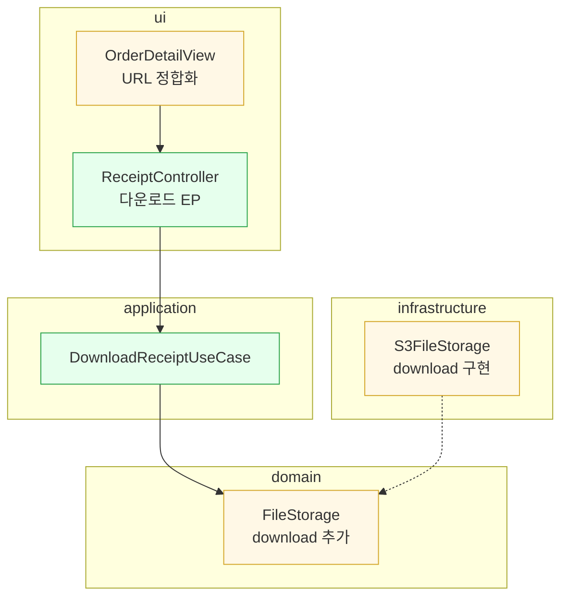
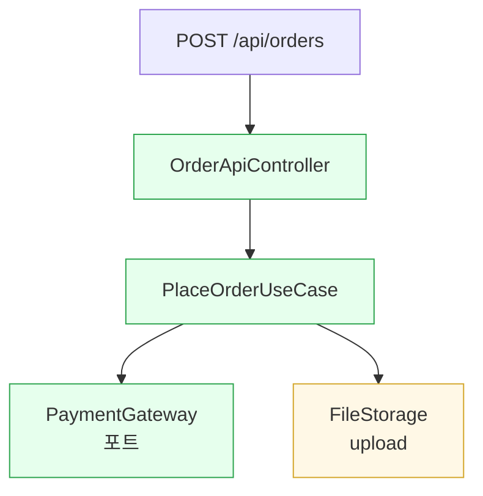

# PR 본문 다이어그램

PR 본문 Summary 아래에, 변경을 한눈에 보여주는 다이어그램을 **optional**로 붙인다.
목적은 리뷰어가 diff를 열기 전에 "무엇이 어디서 바뀌었나"를 파악하는 것이다.
변경 요약 다이어그램 중 PR 본문에 유효한 것만 추려, 임팩트순으로 최대 2개까지만 압축한다.

아래 예시의 계층 이름(domain / application / ui / infrastructure)과 주문(Order) 도메인은
설명용이다. 실제로는 그 레포의 계층 구분과 이름을 쓴다.

## 전역 규칙 (기름기 빼기)

- **최대 2개 섹션.** 아래 트리거가 여럿 켜져도 임팩트순으로 2개까지만 넣는다.
- **0개도 정상.** 단일 파일과 단일 계층 변경이면 다이어그램 없이 diff로 충분하다.
- **계층 변경 맵과 도메인 경계는 겹친다** - 보통 둘 중 하나만 넣는다.
- 각 섹션은 **자기 트리거가 켜질 때만** 후보가 된다.
- 다이어그램 뒤 산문 설명 금지(한 줄 범례까지). 코드/diff 본문 인용 금지.
  변경 안 된 컴포넌트는 경계 이해에 꼭 필요한 최소만, 주인공으로 그리지 않는다.

## 섹션 메뉴

### 1. 계층 변경 맵 - ASCII

- **트리거**: 변경 파일이 3개 계층 이상에 흩어짐.
- **렌더**: ASCII 트리 (파일 트리는 ASCII 가 조밀하고 정확, mermaid는 지저분).
- **계약**: 변경 파일만, 계층별 그룹, 파일당 마커(`[+]` 추가 / `[~]` 변경 / `[mv]` 이동 / `[-]` 삭제)
  + 10자 이내 요지. 공통 패키지 접두사는 생략.

````markdown
```
domain/order/          OrderLine.kt             [+] 주문 줄 VO
application/order/     PlaceOrderUseCase.kt     [+] 주문 유스케이스
ui/order/              OrderApiController.kt    [+] 주문 API
infrastructure/order/  OrderMapper.kt           [~] 매핑 조정
```
````

### 2. 도메인 경계 - mermaid flowchart

- **트리거**: 변경이 2개 이상 계층에 걸침.
- **렌더**: mermaid flowchart (GitHub 렌더 + 의존 방향 시각화).
- **계약**: `subgraph`로 계층을 위에서 아래로 의존 순서(ui, application, domain,
  infrastructure는 domain 옆)로 묶는다. 변경 노드만, **8개 이하**, 테스트 제외.
  라벨 = 컴포넌트명(+ `<br/>` 요지 10자 이내). 시그니처, 라우트, `«stereotype»`, 이모지 금지.
  변경 표시는 `classDef` 3종(`added`/`changed`/`removed`)만. 의존 `-->`, 구현 `-.->`.

````markdown

````

### 3. 동작 흐름 - mermaid

- **트리거**: 신규/변경된 런타임 경로(엔드포인트, 이벤트, 배치)가 있음.
- **렌더**: mermaid flowchart(호출 순서). `sequenceDiagram`은 참여자 4개 이하일 때만.
- **계약**: 진입점부터 핵심 협력자까지만, **8노드 이하**. 변경 컴포넌트에 `:::added`/`:::changed`.
  분기, 검증, 상세 로직은 생략한다.

````markdown

````

### 4. 변경 인과 흐름 - ASCII

- **트리거**: 하나의 결정(도메인 결정과 스키마 변경)이 여러 파일 변경을 촉발.
- **렌더**: ASCII 인과 화살표 (`->`, `|`, `v`).
- **계약**: 근본 원인을 `[대괄호]`로 먼저 명시, 화살표는 원인에서 결과로.
  단순 리팩터(이동과 리네임)는 제외한다.

````markdown
```
[도메인 결정] shippingAddress: Order 필수 -> Delivery 선택
  Order.kt --제거-> Delivery.kt --추가
      |                 |
      v                 v
  OrderJpaEntity     DeliveryMapper
```
````
