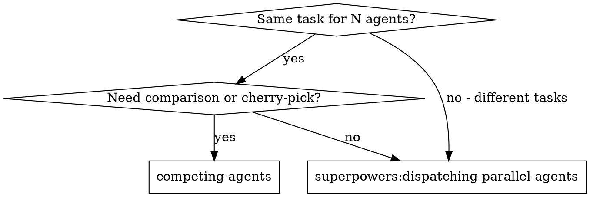
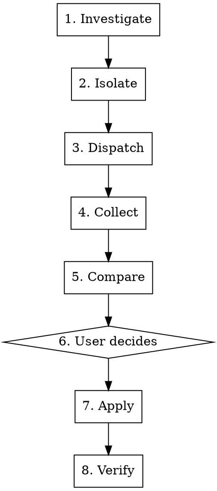

# Competing Agents

Multiple agents independently implement the same task in isolated environments. Results are compared in a structured report. The user cherry-picks the best combination.

**Core principle:** Competition produces better outcomes than single-agent execution. Cross-comparison catches hallucinations and reveals trade-offs invisible to any single implementation.

## When to Use



**Use when:**
- User requests competitive/independent implementations of the same task
- Multiple valid approaches exist and the best combination is unclear
- Cross-validation of results is needed (hallucination guard)
- User wants to review and decide the final composition themselves

**Don't use when:**
- Task has a single correct answer (config change, version bump)
- Different independent tasks need parallelism → `superpowers:dispatching-parallel-agents`
- Sequential tasks with review gates → `superpowers:subagent-driven-development`

## Process



### Phase 1: Investigate

Read source code to gather context for agent prompts. Agents have zero conversation history — everything they need must be in the prompt.

Gather:
- API endpoints, schemas, model structures
- Code conventions and dependencies
- Task scope, constraints, acceptance criteria
- File paths agents must read before implementing

**Do NOT skip this phase.** Thin prompts produce shallow, divergent results that waste the comparison.

### Phase 2: Isolate

Create N isolated environments. Agents must never share a working directory.

**Git repo → prefer native isolation:**
```
Agent({ isolation: "worktree", ... })
```

**Non-git directory (vault, unmanaged folder) → /tmp copy:**
```bash
cp -R "$SRC" /tmp/{project}-alpha
cp -R "$SRC" /tmp/{project}-bravo
cp -R "$SRC" /tmp/{project}-charlie
```

**RECOMMENDED:** When in a git repo, use `superpowers:using-git-worktrees` conventions for isolation. When worktree creation fails (sandbox, non-git), fall back to /tmp copies.

### Phase 3: Dispatch

Send all agents in a **single message** so they run concurrently. Each agent gets:

1. **Identity** — Agent name (Alpha, Bravo, Charlie, ...)
2. **Task spec** — Goal, acceptance criteria, constraints
3. **Context** — API contracts, schemas, relevant code excerpts (inline in prompt)
4. **Isolation path** — Their specific working directory
5. **Files to read** — Explicit paths to source files the agent must read before implementing
6. **Background flag** — `run_in_background: true`

**Defaults (when user does not specify):**
- Agent count: 3
- Model: sonnet

```
Agent({
  description: "Alpha: {task_name}",
  model: "sonnet",
  prompt: "You are Agent Alpha. ... Work in /tmp/{project}-alpha/...",
  run_in_background: true
})
// Bravo, Charlie dispatched in the same message
```

**Prompt quality matters.** Each agent prompt should be self-contained: include the full task spec, relevant API contracts, schema definitions, and file paths. Agents cannot ask clarifying questions — front-load everything.

### Phase 4: Collect

Wait for background completion notifications. Do NOT poll or sleep.
- Record results as each agent completes
- Wait until ALL agents finish before proceeding to comparison
- If an agent fails, note the failure reason for the report

### Phase 5: Compare

Read each agent's actual output files (not just their summary text). Summaries describe intent, not reality.

**Hallucination guard checklist:**
- [ ] Files actually exist on disk
- [ ] Files contain non-trivial content (not stubs)
- [ ] Code is syntactically valid
- [ ] Acceptance criteria from the task spec are met

**Comparison report structure:**

```markdown
## Comparison Report: {task_name}

### Overview
| Aspect | Alpha | Bravo | Charlie |
|--------|-------|-------|---------|
| Approach | ... | ... | ... |
| File structure | ... | ... | ... |
| Strengths | ... | ... | ... |
| Risks/Gaps | ... | ... | ... |

### Detailed Comparison

#### {Comparison axis 1}
- **Alpha**: ...
- **Bravo**: ...
- **Charlie**: ...

#### {Comparison axis 2}
...

### Recommended Composition
{Rationale + suggested cherry-pick combination}
e.g., "Alpha's main structure + Charlie's error handling"
```

Present the report and wait for user decision — unless the unanimous rule applies (see Phase 6).

### Phase 6: User Decides

**Unanimous auto-apply rule:** If ALL agents produced byte-identical file changes (verified by `diff`, not by summary text), skip user confirmation and proceed directly to Phase 7 (Apply). Report what was auto-applied and why ("3/3 동일 변경 — 자동 적용"). This is the ONLY case where user confirmation is skipped.

**Otherwise, do NOT apply changes until the user explicitly chooses.**

The user may:
- Select a single agent's output wholesale
- Cherry-pick a combination ("Alpha's X + Charlie's Y")
- Request modifications before applying
- Reject all and ask for a re-run

### Phase 7: Apply

Copy the selected files from isolation to the original source.
- For cherry-pick compositions, manually merge the chosen parts
- For single-agent selection, copy directly

### Phase 8: Verify

Run the deliverable in the real environment before declaring success.
- Build, test, or integration verification as appropriate
- **Do NOT update issue status (Linear, etc.) until verification passes**

### Phase 9: Finalize (invoke `post-cleanup`)

After verification passes, invoke the `post-cleanup` skill to:
- Clean up /tmp isolation directories (sandbox-safe)
- Commit with project conventions
- Update issue tracker status

## Quick Reference

| Situation | Action |
|-----------|--------|
| Git repo | `isolation: "worktree"` or superpowers:using-git-worktrees |
| Non-git (vault, etc.) | `/tmp/{project}-{name}` copies |
| Agent count not specified | Default 3 |
| Model not specified | Default sonnet |
| Results diverge significantly | Highlight divergence in report |
| One agent fails | Proceed with remaining, report failure |
| Before user decision | Never touch original source |
| Before verification | Never update issue status |

## Common Mistakes

**Thin prompts:** Agents have no conversation context. Omitting API contracts, schemas, or file paths produces shallow results that defeat the purpose of competition.

**No isolation:** Multiple agents writing to the same directory causes silent corruption. Always isolate.

**Trusting summaries over disk:** Agent summaries describe intent. Read the actual files to verify. `tool_uses=0` in an agent result is a red flag — the agent likely hallucinated its work.

**Applying before user decision:** The entire point is user choice. Never preemptively apply any agent's output.

**Skipping verification:** "It compiles" is not verified. Run the actual workflow (docker compose up, test suite, etc.) before updating any tracking system.

## Integration

**RECOMMENDED:** `superpowers:using-git-worktrees` — For isolation in git repos
**DOWNSTREAM:** `post-cleanup` — Cleanup, commit, and issue status update after Phase 8
**RELATED:** `superpowers:dispatching-parallel-agents` — For different-task parallelism (not same-task competition)
**RELATED:** `superpowers:subagent-driven-development` — For sequential task execution with review gates
**MEMORY:** `feedback-competing-subagents` — User preference for competition over delegation

## Red Flags

**Never:**
- Apply to original before user decides
- Update issue status before verification
- Skip the comparison report
- Trust agent summaries without reading actual files
- Dispatch agents sequentially (always parallel in one message)

**Always:**
- Investigate source code before writing prompts
- Isolate every agent
- Include full context in every agent prompt
- Verify on-disk output before reporting
- Wait for user's explicit composition decision
